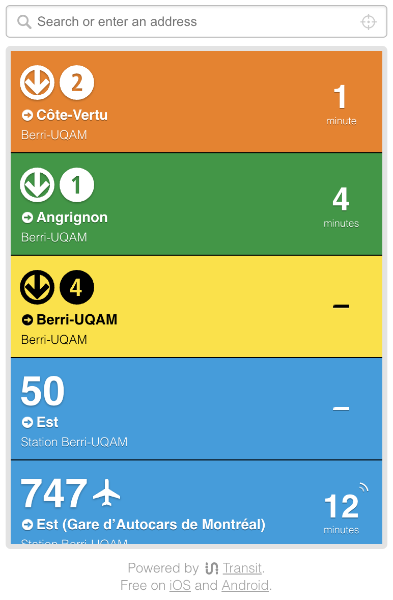

# Transit-NearbyWebWidget
Use the Transit API to show next departure of a location similar to the main screen of the Transit app. 



> [!WARNING]  
> Transit Widget was built by the Transit team as a fun project to demo our API, usage of this project comes with no garantee of any kind. 

## How to get started 

1) Request API access

Go the the [Transit API page](https://transitapp.com/apis) and request access to the an API key.  When you have the API key, you can place it in the `.env` file. 

2) Test locally

Assuming you have node and pnpm installed (we recommend using `nodenv` to follow the `.node-version` file)

```sh
pnpm install
pnpm build
pnpm start
```

Then follow the instructions and open http://localhost:8080

3) Deploy somewhere! 

You should be ready to deploy somewhere if you want to use it for a longer amount of time. 

## Contribute

This project was built mostly for fun and hasn't been updated recently and needs some love. PRs welcome!
